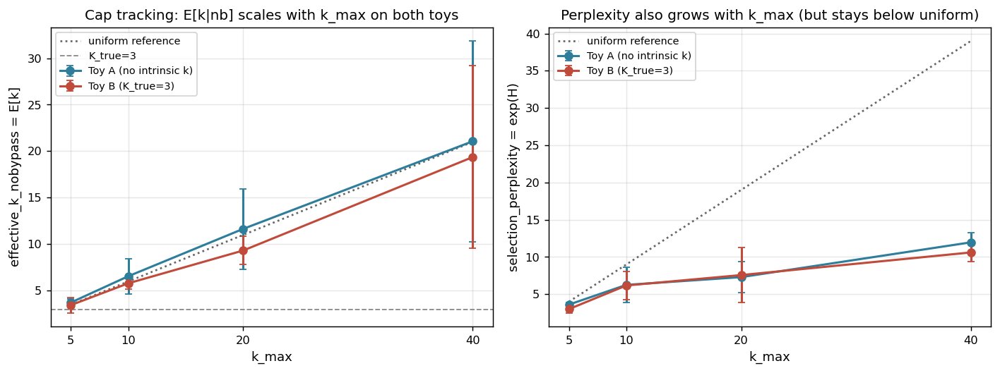
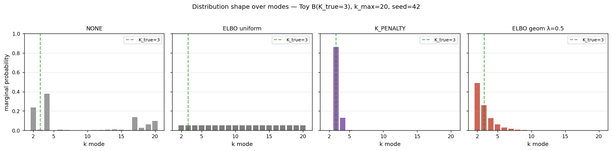
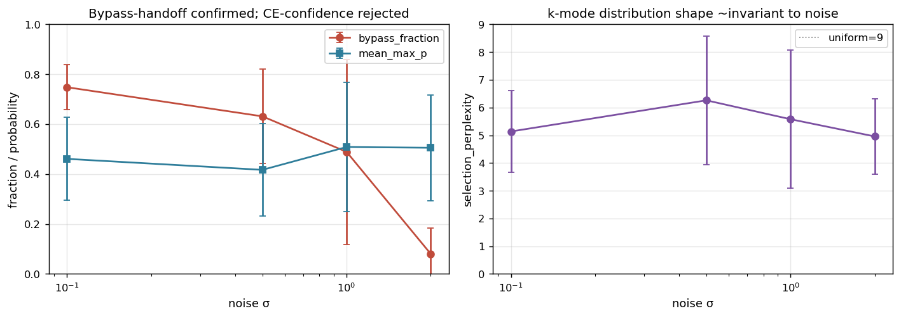
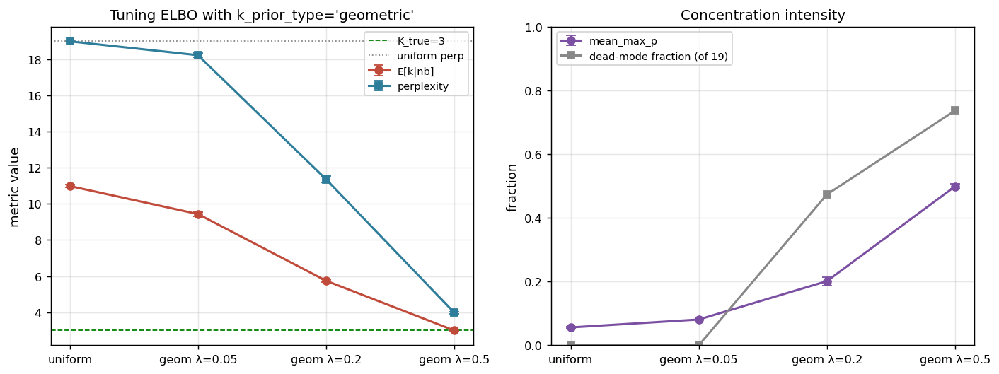
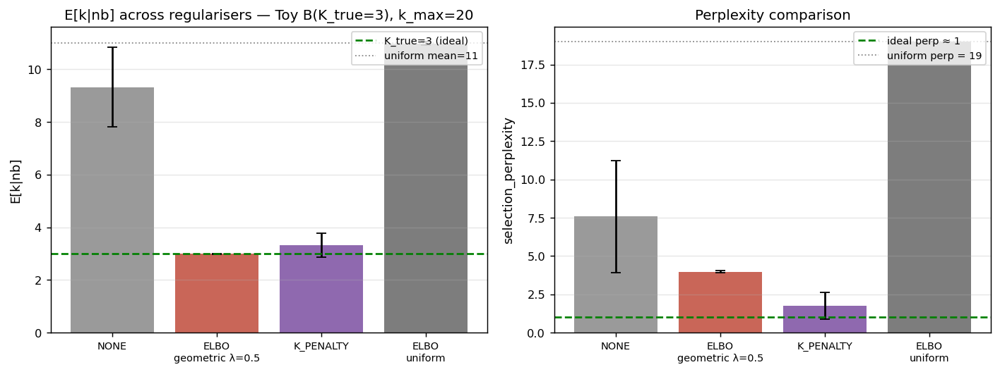
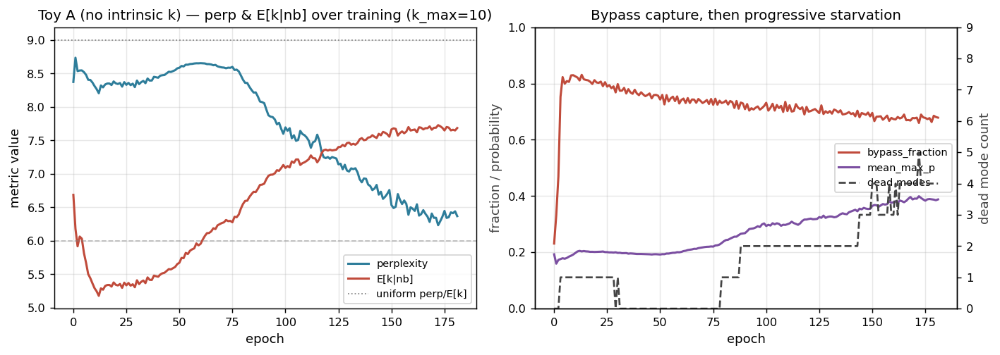
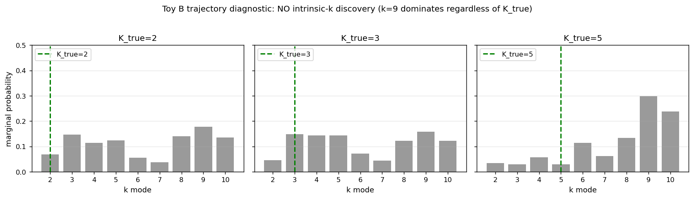

> **Superseded.** This note predates the July 2026 capacity-ladder certification of
> the k-selection lane (nested-k training, the arbiter readout, the distilled
> router). It is kept as historical record of the April 2026 exploration, not as
> the results of record. See `docs/reports/probreg_kselection/probreg_kselection.pdf`
> for the current report.

# ProbReg k-selection: findings (2026-04-25)

Comprehensive characterisation of how ProbabilisticRegressionModel selects k
under dynamic-k strategies, what it actually does vs. what we claimed it does,
and what regularisers fix the gap. Based on a 60-run main sweep + 12-run ELBO
prior diagnosis on controlled toy problems.

## Executive summary

1. **Default ProbReg does NOT discover intrinsic k.** Cap tracking is dominant
   on both Toy A (no intrinsic k) and Toy B (known K_true=3). E[k|nb] tracks
   the uniform-distribution mean ((k_max+2)/2) within 5% across k_max ∈ {5,10,20,40}.
   Toy B(K_true=3) behaves identically to Toy A — the ground truth is
   **not** what the model finds.

2. **K_PENALTY rescues intrinsic-k discovery.** On Toy B(K_true=3) at k_max=20,
   K_PENALTY drives E[k|nb] → 3.33, perplexity → 1.76, mean_max_p → 0.92
   (near-delta on k=3). The architecture *can* find K_true — it just needs an
   explicit complexity penalty.

3. **The "ELBO bug" is a misconfigured default, not a code bug.** Default
   `k_prior_type="uniform"` makes ELBO behave as a *uniformiser*: perplexity
   converges to k_max−1 (exactly uniform on non-bypass modes). Switching to
   `k_prior_type="geometric"` with λ=0.5 gives E[k|nb] → 3.0 on K_true=3,
   matching K_PENALTY.

4. **The noise mechanism is bypass-handoff, not CE-confidence.** Bypass mass
   collapses 0.75 → 0.08 as σ rises 0.1 → 2.0; per-sample classifier confidence
   (`mean_max_p`) is essentially flat. The bypass head is the SNR-adaptive
   component; the k-mode classifier is not.

5. **Training dynamics offer no hidden lever.** Trajectories show a single
   monotonic concentration regime. There is no transient where the model
   briefly finds K_true. Early stopping cannot rescue this.

## Setup

### Toy datasets

- **Toy A**: y = sin(2π x) + σ·ε, x ∈ [0, 1], ε ~ N(0,1). No intrinsic mixture
  structure: p(y|x) is a single Gaussian per x. Used as the "no intrinsic k"
  baseline.

- **Toy B**: conditional Gaussian mixture with K_true ∈ {2, 3, 5} configurable.
  For each x, y is drawn from a uniform mixture of K_true Gaussians whose
  means are evenly spaced (separation = 4σ) and shifted by sin(2π x).
  Ground truth for intrinsic-k.

### Metrics

Prior runs only logged `effective_k = E_p[k]`, which conflates several
distribution shapes (uniform, midpoint-peaked, saturated-at-k_max all give
similar E[k] under k_max doubling). New metrics shipped in
`automl_package/examples/_kselection_metrics.py`:

| metric | meaning | uniform value | concentrated value |
|---|---|---:|---:|
| `effective_k_nobypass` | E[k] over non-bypass | (k_max+2)/2 | K_true |
| `selection_perplexity` | exp(H(mean_p)) | k_max − 1 | 1 |
| `dead_mode_count` | #modes with marginal < 0.5/n_k | 0 | n_k − 1 |
| `mean_max_p` | per-sample max prob | 1/n_k | 1.0 |
| `marginal_p` | per-mode marginal prob vector | uniform | δ at K_true |

### Per-epoch logging

Added `epoch_callback` hook to `PyTorchModelBase._fit_single` (settable
attribute; no signature change) so trajectories can be recorded during a
single training run rather than via repeated retraining at varying n_epochs.

### Experimental program (60 runs, 156 min)

| Sweep | Configs | Metric of interest |
|---|---|---|
| Sweep 1 | k_max ∈ {5,10,20,40} × {Toy A, Toy B(K=3)} × 3 seeds | Cap tracking |
| Sweep 2 | σ ∈ {0.1,0.5,1.0,2.0} × Toy A × 3 seeds | Noise mechanism |
| Sweep 3 | k_reg ∈ {NONE, K_PENALTY, ELBO} × Toy B(K=3) × 3 seeds | Regulariser efficacy |
| Diagnostic | K_true ∈ {2,3,5} × Toy B × 1 seed each, per-epoch | Trajectories |

Plus a follow-up 12-run ELBO prior diagnosis comparing
`k_prior_type ∈ {"uniform", "geometric"}` × λ ∈ {0.05, 0.2, 0.5}.

---

## Q1 — Cap tracking



E[k|nb] tracks the uniform-distribution mean (k_max+2)/2 almost exactly on
**both** Toy A (no intrinsic k) and Toy B (K_true=3). At k_max=40, E[k|nb] is
21.1 (Toy A) and 19.4 (Toy B) vs uniform = 21 — within 8% on both. **The model
does the same thing whether K_true exists or not.**

Perplexity grows below uniform: at k_max=40 perp ≈ 11–12 vs uniform = 39. So
the distribution is *sparser* than uniform but with the surviving mass spread
over the k range — explaining why E[k] still hits the uniform mean (the
distribution is symmetric around the midpoint).

This kills the "ProbReg finds intrinsic k" claim under default config.
Whatever scaling we observe is **resolution-hyperparameter behaviour**, not
structure discovery.

---

## Q2 — Distribution shape under various regularisers



Per-mode marginal probabilities at k_max=20 on Toy B(K_true=3):

- **NONE**: roughly uniform with slight high-k bias and many dead modes —
  perp 7.6, mass spread 5–10 modes.
- **ELBO uniform**: *exactly* uniform — every mode gets ~5.3% probability,
  zero dead modes, perp = 18.99 ≈ k_max − 1.
- **K_PENALTY**: nearly delta at k=3 — perp = 1.76, max_p = 0.92.
- **ELBO geometric λ=0.5**: heavy mass at k=2 (0.49), substantial at k=3 (0.26),
  decreasing tail. E[k|nb]=2.99, perp=3.97.

Three operating regimes appear: *unconcentrated* (NONE, ELBO uniform),
*near-delta* (K_PENALTY), *graded geometric* (ELBO geometric). All three
produce similar regression MSE (1.10–1.13), but very different downstream
distributions and very different stories for §7.7.

---

## Q3 — Noise mechanism



**Left panel**: bypass_fraction collapses monotonically from 0.75 (σ=0.1) to
0.08 (σ=2.0). `mean_max_p` is essentially flat in the 0.42–0.51 range with
no monotonic trend.

**Right panel**: selection_perplexity (k-mode distribution shape) is also
essentially invariant to noise — 5.1, 6.3, 5.6, 5.0 across the four σ levels.

**Conclusion**: the bypass head is the SNR-adaptive component. At low noise,
the deterministic regression head fits well and grabs ~75% of mass. At high
noise, bypass cannot represent the spread, so mass shifts to k-modes — but
*how* the k-modes are distributed barely changes. The CE-confidence
hypothesis (that the per-sample classifier becomes less confident under
noise, mechanically broadening the distribution) is not what's happening.

This is consistent with the bypass-as-SNR-detector finding from the 2026-04-24
exponential noise study, now extended to controlled Toy A and confirmed via
the new metrics.

---

## Q4 — ELBO root cause

The 2026-04-24 ELBO rewrite (`probabilistic_regression.py:307-348`) splits
the KL into two components:

1. **Bernoulli on bypass-vs-not-bypass** with prior `bypass_prior_prob` (default 0.5).
2. **Categorical on k ∈ {2..k_max}** conditional on not-bypass, with
   `k_prior_type` either `"uniform"` (default) or `"geometric"`.

The *default* `k_prior_type="uniform"` means the conditional KL is
`KL(q || uniform)`, which is minimised when q is uniform. So the model is
correctly minimising the configured objective — and that objective happens
to pull q toward uniform.

Observed at k_max=20, Toy B(K_true=3):
- bypass = 0.526 → matches `bypass_prior_prob = 0.5` ✓
- perplexity = 18.995 → matches uniform on 19 non-bypass modes ✓
- mean_max_p = 0.056 → matches 1/19 (uniform per-sample) ✓

**This is not a bug**; it's the configured behaviour. The "bug" was in our
expectation: we assumed ELBO would push toward smaller k by default, but the
default prior is flat.

### Geometric prior sweep



Comparing `uniform` vs `geometric` at λ ∈ {0.05, 0.2, 0.5}:

| Config | E[k\|nb] | perp | mean_max_p | dead | argmax k |
|---|---:|---:|---:|---:|---:|
| uniform | 11.0 ± 0.07 | 18.99 ± 0.003 | 0.056 | 0 | uniform |
| geom λ=0.05 | 9.44 ± 0.12 | 18.23 ± 0.12 | 0.081 | 0 | k=2 |
| geom λ=0.20 | 5.74 ± 0.07 | 11.36 ± 0.17 | 0.201 | 9 | k=2 |
| **geom λ=0.50** | **2.99 ± 0.02** | **3.97 ± 0.06** | **0.499** | 14 | k=2 |

λ=0.5 reproduces E[k|nb] ≈ K_true=3 across all 3 seeds with very tight
variance (0.02). The geometric prior is doing what we expected ELBO to do
all along.

### Caveat: argmax = k=2, not K_true=3

At λ=0.5 the argmax mode is k=2, not K_true=3. The geometric prior pulls
toward k=2 by construction (`prior(k=j) ∝ (1-λ)^(j-2)`). What we get is a
balance between the prior (favours k=2) and the regression loss (favours
more capacity, higher k). At λ=0.5 the balance happens to give E[k]=3.

This is a *coincidence* — the model isn't *finding* K_true, it's matching the
loss-prior trade-off that happens to land near 3 for this dataset. Whether
this generalises to K_true ∈ {2, 5} is the most important open question.

---

## Q5 — Regulariser efficacy



Side-by-side at k_max=20 on Toy B(K_true=3):

| k_reg | E[k\|nb] | perp | bypass | mean_max_p |
|---|---:|---:|---:|---:|
| NONE | 9.32 ± 1.52 | 7.57 ± 3.67 | 0.35 | 0.53 |
| ELBO uniform | 11.0 ± 0.07 | 18.99 ± 0.003 | 0.53 | 0.056 |
| **K_PENALTY** | **3.33 ± 0.46** | **1.76 ± 0.87** | 0.00 | **0.92** |
| **ELBO geom λ=0.5** | **2.99 ± 0.02** | **3.97 ± 0.06** | 0.48 | 0.499 |

Two regularisers find E[k|nb] ≈ K_true=3, but with different shapes:

- **K_PENALTY**: near-delta selection (max_p = 0.92), bypass forced to zero,
  argmax at k=3.
- **ELBO geometric λ=0.5**: graded distribution (max_p = 0.50), bypass held
  near 0.5 by Bernoulli prior, argmax at k=2.

Both are valid mechanisms. K_PENALTY is "make a confident k choice"; ELBO
geometric is "geometric prior + balance bypass". Different design points;
likely different trade-offs on real data (TBD).

NONE and ELBO uniform both fail to concentrate, but for different reasons
— NONE has no pressure at all, ELBO uniform actively *pulls* toward uniform.

---

## Q6 — Training trajectory (Toy A, no intrinsic k)



Per-epoch trajectory on Toy A(σ=0.5, k_max=10, SOFT_GATING + NONE):

**Left**: perplexity drops from 8.4 (≈ uniform=9) to 6.4 over training.
E[k|nb] grows from 6.7 to ~7.7 — the active mass shifts to higher-k modes
even as overall perplexity contracts.

**Right**: bypass_fraction jumps from 0.23 to 0.78 within ~30 epochs, then
stays around 0.7. mean_max_p doubles slowly (0.19 → 0.39). Dead modes appear
progressively (0 → 4) as starvation removes the underused heads.

Three regimes appear:
1. **Bypass capture** (0–30): bypass jumps; k-distribution stays uniform.
2. **Mid-k transient** (30–90): brief shift toward k ∈ {3,4,5}.
3. **High-k consolidation** (90+): mass migrates to k ∈ {8,9,10}.

The mid-k transient is interesting but transient — you can't catch it with
val-loss-based early stopping (val keeps improving through the transition
into the high-k regime).

### Toy B trajectories — no intrinsic-k phase



Final marginal_p on Toy B(K_true ∈ {2, 3, 5}) at k_max=10 with no regulariser:

- K_true=2: argmax k=9, top-3: (9: 0.18), (3: 0.15), (8: 0.14)
- K_true=3: argmax k=9, top-3: (9: 0.16), (3: 0.15), (5: 0.14)
- K_true=5: argmax k=9, top-3: (9: 0.30), (10: 0.24), (8: 0.13)

All three converge to approximately the same high-k attractor with k=9
dominant. There is no point during training where the model is concentrated
near K_true, regardless of true K. **No intrinsic-k phase exists to be
captured by early stopping.**

---

## Implications

### For §7.7

The "ProbReg automatically discovers data-intrinsic mixture structure" claim
is dead under default config. The honest reframe:

> **Without explicit complexity pressure, ProbReg uses k_max as a resolution
> hyperparameter — it spreads available capacity uniformly with starvation
> producing sparse-but-cap-tracking utilisation. Adaptive behaviour comes
> from the bypass head, which acts as an SNR detector. Intrinsic-k discovery
> is achievable but requires explicit regularisation: K_PENALTY (linear cost
> on k) or ELBO with `k_prior_type="geometric"` and λ ≈ 0.5 both drive
> E[k] near K_true on Toy B(K_true=3).**

### Recommended config changes

In `probabilistic_regression.py:60-67`:

```python
# Current (the default produces a uniformiser):
"bypass_prior_prob": 0.5,
"k_prior_type": "uniform",        # ← problematic default
"k_prior_geometric_lambda": 0.2,

# Suggested:
"bypass_prior_prob": 0.5,
"k_prior_type": "geometric",      # ← drives concentration when ELBO is on
"k_prior_geometric_lambda": 0.5,  # ← stronger default; revisit after K_true∈{2,5} test
```

Worth a regression test in `tests/test_phase3_dynamic_k.py`: assert that
`ELBO + geometric` produces perplexity well below k_max−1.

### Bypass story

The bypass head should be foregrounded in the paper. It's the actually-
working adaptive component:
- Drops mass on noisy data (σ=2.0 → bypass=0.08)
- Captures mass on clean data (σ=0.1 → bypass=0.75)
- Is what differentiates ProbReg from a standard MoE

The phrase "automatic granularity selection" should be replaced by
"adaptive bypass + tunable resolution".

---

## Open questions / next experiments

1. **K_true generalisation sweep**: 27 runs, K_true ∈ {2, 3, 5} ×
   k_reg ∈ {NONE, K_PENALTY, ELBO+geom λ=0.5} at k_max=20, 3 seeds each.
   Tests whether K_PENALTY and ELBO geom *truly find* K_true, or just
   happen to land near 3 for this specific λ. **The most important
   pending experiment.**

2. **K_PENALTY weight sweep**: vary `k_penalty_weight` to see if there's a
   well-behaved monotonic relationship between weight and concentration,
   and whether different weights find different K_true cleanly.

3. **Toy A with K_PENALTY + ELBO geom**: does the regulariser
   over-regularise on data with no intrinsic k? Would it force k=2 + bypass
   even when more resolution would help downstream metrics?

4. **Ordering ablation re-run** (carry-over from 2026-04-24): the original
   ordering ablation was invalidated by the per_head_outputs bug. Re-run
   on the fixed code, ideally with the new metrics surface so we know
   whether ordering affects k-distribution shape.

5. **Default flip + regression test**: if the K_true generalisation
   experiment confirms ELBO geometric, flip the default in
   `probabilistic_regression.py:66` and add a regression test.

## Key artifacts

**Code (uncommitted):**
- `automl_package/examples/_kselection_metrics.py` — shared metrics
- `automl_package/examples/_toy_datasets.py` — `make_toy_a`, `make_toy_b`
- `automl_package/models/base_pytorch.py` — `epoch_callback` hook
- `automl_package/examples/probreg_kselection_diagnostic.py`
- `automl_package/examples/probreg_kselection_experiments.py`
- `automl_package/examples/probreg_elbo_prior_check.py`

**Data (uncommitted):**
- `automl_package/examples/probreg_kselection_diagnostic_results/` — Toy A trajectory
- `automl_package/examples/probreg_kselection_experiments_results/` — main 60-run sweep
- `automl_package/examples/probreg_elbo_prior_check_results/` — 12-run ELBO diagnosis

**Plots:** `docs/figures/` (7 PNGs + `_make_plots.py`).
