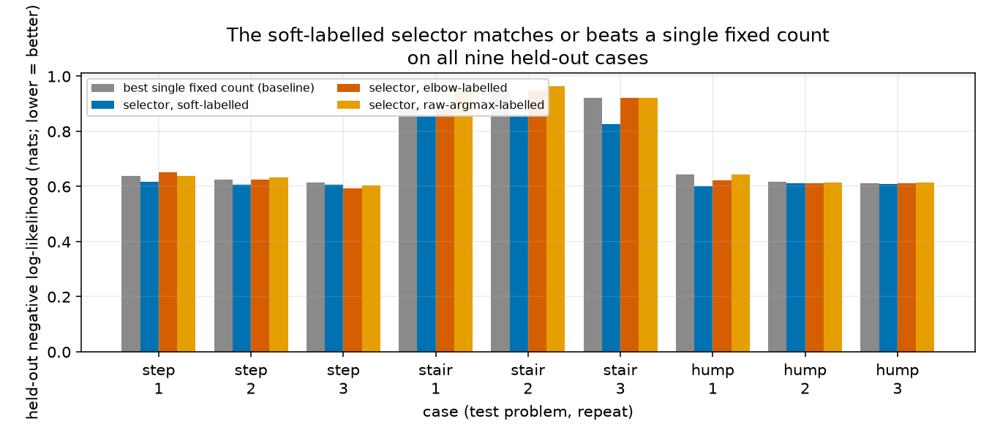

% Choosing how many classes each input needs: a per-input resolution selector for a class-based regression model
% Jordan Elridge
% 18 July 2026

<!-- report-figures: fig-kselect-invalid fig-kselect-arbiter fig-kselect-router fig-kselect-negatives -->

# Summary

A regression model that predicts a number for each input can be built as a small
classifier: split the space of possible outputs into a handful of classes, have a
network read the input and say how likely each class is, and let a local sub-model
inside each class refine the prediction further. Earlier work on this design asked
how many classes it should have overall. This report asks a sharper question: how
many classes does *this particular input* need, and can the model be trusted to say
so honestly, input by input?

The answer, established across a set of controlled synthetic test problems, is
qualified but genuinely positive. A model trained the right way — with a randomly
resampled class budget at every training step, rather than a fixed budget fitted once
— can be read afterward with a simple, neighbour-smoothed statistic whose value
rises with the true number of classes a region of the input space needs, even as
that number rises from one region to the next. The naive way of getting the same
information — asking, for a single input, at what class count the model's fit stops
improving — does not work: it is far too noisy, and even reproducing it correctly at
the whole-dataset level requires the right training scheme. The good news extends
further: the per-input reading can be distilled into a small, separate selector that
is cheap to run and never does worse than fixing one class count for the whole
dataset, across nine audited cases — three test problems, three repeats each.

The picture is not complete. On a test problem where the true class count rises and
then falls again as the input increases — rather than only rising — the method
recovers on only one of three random repeats at the sample size first tested; a
dedicated follow-up study, using a differently built version of the same check, later
showed this specific failure was a matter of having too little data, not a
fundamental limit — recovery becomes reliable, under that follow-up's own
measurement, once the sample size is quadrupled, though whether this report's own
measurement (Section 3) would show the same improvement at more data has not been
tested. And the same style of instrument, applied
elsewhere in this model family to choose how flexible a noise-level function should
be rather than how many classes to use, shows an analogous and better-understood
limitation: it reliably detects that flexibility is needed at all, but it stops one
notch short of the most accurate choice, because the scoring rule behind it is nearly
insensitive to that last refinement. Both boundaries are reported in full below,
because a method that only reports its successes cannot be trusted with its
failures.

# 1. The question: how much resolution does a prediction need, and does it depend on the input?

## 1.1 A regression model built as a classifier

The model this report studies predicts a number $y$ from an input $x$ by first
choosing among $k_{\max}$ classes, where $k_{\max}$ is a ceiling fixed in advance
(its value for each test problem is given in Section 1.3). A small network reads
$x$ and produces a score for each class, turned into a probability by the softmax
function,
$$
\pi_j(x) \;=\; \frac{\exp(\ell_j(x))}{\sum_{i=1}^{k_{\max}} \exp(\ell_i(x))}, \qquad j = 1, \dots, k_{\max},
$$
so $\pi_j(x)$ is the model's belief that input $x$ belongs to class $j$, and
$\ell_j(x)$ is that class's raw score before the softmax turns it into a
probability. This is a genuine classifier: the class probabilities are recomputed
from scratch for every input, not a fixed set of weights shared by all inputs. Each
class $j$ also carries its own small regression sub-model, which reads $x$ and
outputs a local mean $\mu_j(x)$ and variance $\sigma_j^2(x)$ — in other words, a
full local bell-curve (Gaussian) prediction for $y$,
$\phi_j(y \mid x) = \mathcal{N}\big(y;\, \mu_j(x),\, \sigma_j^2(x)\big)$, specific to
that class. The class probabilities and the per-class bell curves combine into one
predictive distribution for $y$ given $x$,
$$
p(y \mid x) \;=\; \sum_{j=1}^{k_{\max}} \pi_j(x)\, \phi_j(y \mid x),
$$
a weighted blend of all $k_{\max}$ local bell curves, weighted by how likely the
classifier thinks each class is for that input. How well this combined
distribution matches the held-out data — data never used to fit the model, kept
aside purely to check how well the fit generalises — is measured throughout this
report by its log-likelihood: the natural logarithm of the probability density the
model assigns to the observed value, averaged over many held-out points and
reported in units called **nats** (the natural-log analogue of "bits," which use
logarithms base 2). Higher (less negative) log-likelihood is a better fit, and most
of this report — Sections 1 through 4 and Section 6.1 — reports the quantity
directly in that form, so a larger number is better there. A few places instead
report its negative, the *negative log-likelihood* — the quantity actually
minimised during training, where a *smaller* number is better — namely Section 5's
comparison and Section 6.2's right-hand panel. Every table and figure in this
report states, in its own axis label or caption, which direction is better, so this
is never ambiguous locally, even though the convention is not the same in every
section.

The number of classes actually needed, for a given input, is therefore not just an
architectural choice; it is the resolution at which the model is allowed to see
structure in the data at that input. Using just one class reduces the whole model
to one ordinary regression model with one input-dependent bell curve — no
classification is happening at all. Using more classes lets the model represent
output distributions with several separated peaks, at the cost of needing more data
to pin down where those peaks are and how much probability each one carries.

## 1.2 What earlier work found, and why it does not answer this report's question

An earlier study of this same class-based model (April 2026) asked whether, left to
train freely with a generous class budget, it would settle on a small number of
classes that matches some fixed, dataset-wide "true" count — the same question a
practitioner asks when picking a single class count once, as a hyperparameter, before training.
That study found it mostly does not: without an explicit penalty for using more
classes, the model spreads its probability across roughly as many classes as it is
given, regardless of whether the target data has any actual multi-peaked structure at
all. Forcing concentration required either an extra penalty term or a specific choice
of prior belief about how many classes should be active — both applied globally,
picking one count for the entire dataset.

This report asks a different and harder question. Rather than "how many classes does
the whole dataset need," it asks "how many classes does *this one input* need" — and
whether that number can change across the input range, as it plausibly should when
some regions of a dataset are simple and others are not. Answering that question
turns out to need a different training scheme from the one used to answer the global
question (Section 3), and a different way of reading the trained model afterward
(Section 4). The global-penalty findings from April are not used or re-tested here;
they answered a different question and are mentioned only so the two are not
conflated.

## 1.3 Three test problems, built so the true answer is known

Because the point of this report is to check whether a per-input reading is
*correct*, every test problem below is a synthetic one where the true number of
peaks in the output distribution, at every input value, is fixed by construction and
known exactly. Three problems recur throughout:

- **The single-step problem.** The output distribution has one peak at low $x$ and
  two clearly separated peaks at high $x$, with the separation between the two peaks
  growing steadily as $x$ increases from 0 to 1. The true number of peaks switches
  from one to two partway through the input range.
- **The staircase problem.** The input range is split into three equal bands. In the
  first band the output has one peak; in the second, two evenly spaced peaks; in the
  third, three. Within each band the peaks are spaced widely enough to be
  unambiguous, and all peaks stay centred on zero as a group, with each individual
  peak keeping the same width; what changes across the bands is the number of peaks
  (and, unavoidably, the overall spread, which widens as peaks are added). This is
  the sharpest test of whether a method generalises past a simple
  one-peak-versus-two-peaks distinction to a genuine staircase.
- **The moving-mode problem.** Built like the single-step problem, but the
  separation between the two peaks now follows a hump rather than a ramp: merged
  into one peak at *both* ends of the input range, and only cleanly split into two
  in the middle. The true count therefore goes one, then two, then back to one as
  $x$ sweeps across its range — a pattern a method that merely tracks how spread out
  the values are (which also humps, since two separated peaks are more spread out
  than one) cannot fake, because it has to come back down again.

The single-step and moving-mode problems each have a matched **control** twin: the
same spread of output values at every input, generated from a *single* peak whose
width is widened to exactly match the true problem's spread — so a method that is
fooled by variance alone into manufacturing extra peaks will do so on the control
too, where by construction there are none. A method that reports genuine extra peaks
on the real problem while staying quiet on its variance-matched control is
discriminating real structure, not reacting to noise or spread. The staircase
problem has no such twin; its result therefore rests on the discrimination
demonstrated on the other two.

The model's class ceiling $k_{\max}$ is set well above the true peak count on every
problem, so that a model which simply used its whole budget everywhere, rather than
genuinely adapting to the input, could be caught doing so: 6 classes for the
single-step and moving-mode problems (whose true count never exceeds 2), and 8
classes for the staircase problem (whose true count never exceeds 3) — the sharper
test of whether the model stops where the true structure stops rather than
spreading out to fill whatever budget it is given.

# 2. Why reading the first few classes off an already-trained classifier does not work

The most direct way to ask "does this region of the input space need $c$ classes,
for $c$ smaller than the full budget $k_{\max}$" is to take a model already trained
with the full budget $k_{\max}$, keep only the first $c$ classes in a fixed
ordering fixed once before training (never re-ranked per input), rescale
their probabilities to sum to one, and see how well the resulting $c$-class
distribution fits held-out data. This section reports why that approach — trying it
on the staircase problem with a network trained the ordinary way (all $k_{\max}$ classes
active throughout training, with a penalty encouraging the dataset-wide class usage
to be sparse) — fails outright.

## 2.1 The failure, measured

The classes were seeded, before training, in the order of the target ranges they are
centred near — so that "the first two classes," at the start of training, would have
meant "the two classes covering the lowest part of the output range." But nothing in
training keeps them in that order: the classes are free to move anywhere during
training, and by the end their centres bear no relation to their original order. On
top of that, the penalty that encourages the dataset-wide class usage to be sparse
does not remove weight evenly — it can silence a class at *any* position, including
early ones, while leaving weight on classes further down the list.

Figure 1 shows the consequence for one held-out test case (the staircase problem,
one random repeat of the experiment). Reading only the first class gives an
enormous negative log-likelihood — around $-97$ nats per point compared to the
essentially flat, roughly $-1$-nat curve produced by a set of ordinary, separately
trained models, one built for each class count. Reading two classes is barely better
(about $-38$ nats); only once the prefix reaches the third class does the reading
fall in line with a sensible model of the data. Two consecutive prefixes (four and
five classes) give an *identical* reading. The shape of this curve — most of the gap
concentrated in the first two prefix positions, then no change at all between two
consecutive prefixes — is exactly the signature the previous paragraph describes: a
sparsity penalty free to silence a class at any position in the fixed ordering,
leaving it almost no probability mass to renormalise onto. (The recorded artifact
behind this figure keeps the held-out fit at each prefix length, not each class's
own probability mass, so this reading of *which* positions were silenced follows
from the curve's shape rather than from a directly recorded per-class weight.)

The cleanest demonstration that this is an artefact and not a real signal comes from
the variance-matched control (Section 1.3): on data generated from a single,
unmoving peak, the same read-the-prefix procedure reports a fabricated advantage of
using the full class budget over one class of **42 nats** on one random repeat and
**229 nats** on another. Neither number is physically possible as a genuine gain
from extra classes on single-peaked data — no real distribution fits single-peaked
data 229 nats per point better with five extra classes than with one. The
renormalisation of an arbitrary, unordered subset of classes is capable of producing
an appearance of structure that is not there at all.

## 2.2 The lesson

None of this reflects a defect in the idea of reading a class count from a prefix of
a trained classifier's output. The defect is specific to reading a prefix *after*
training a classifier that was never asked, during training, to make its first $c$
classes the best possible $c$-class summary of the data for every $c$. Because the
classes' order and aliveness are free to settle wherever the (unrelated) sparsity
pressure and the fit to the full-budget target happen to put them, "the first $c$
classes" is, after the fact, an arbitrary subset — not necessarily the best one, and
not even necessarily a coherent one. Producing a genuine answer for every prefix
length requires building that requirement into training itself, which is the subject
of the next section.

# 3. Building the model so every prefix is a real answer

## 3.1 A budget that changes every training step

The fix is to change what the network is asked to do at training time, not how its
output is read afterward. Instead of training once with the full class budget
active for every example, each training example is given its own **budget** $c$,
drawn independently and uniformly at random between 1 and the maximum class count
$k_{\max}$ before every use of that example. Only the first $c$ classes — by
position, the same fixed ordering used throughout training — are allowed to
contribute for that particular use of that example; the rest are masked out
entirely (given zero probability), and the surviving $c$ classes' probabilities are
rescaled to sum to one, exactly as in Section 2's read-only procedure. The training
loss for that step is the negative log-likelihood of the resulting rescaled
$c$-class distribution against the true target — derived in full, together with the
exact masking-and-rescaling formula, in Appendix A. One further ingredient matters
at the start of training, before any of this masking has had a chance to act: each
class's regression sub-model is initialised at a distinct starting point spread
across the target's range (its y-percentile, in this report), not all at the same
place. Without this spread initialisation the network can collapse onto a single
active class on multi-peaked data, for some random seeds, before training-time
masking gets a chance to pull the others apart — this is an initialisation choice,
not an added loss term, so it does not reintroduce a penalty into the training
objective.

Because the budget $c$ is redrawn independently on every use of every example, and
because the very first slot of the fixed ordering is *always* included in every
budget from 1 upward, over the course of training the network is asked, over and
over, "what is the best distribution you can build using only your first class,"
then separately "using only your first two," and so on up to the full budget — for
every input in the training set. This is what forces the first class, on its own,
toward the best possible single-peak summary of the data; the first two classes,
together, toward the best possible two-peak summary; and so on. "The first $c$
classes" becomes, by construction of the training procedure, the network's own
trained answer to "the best $c$-class distribution," for every $c$ — which is
exactly the property Section 2's read-only procedure needed and did not have. The
smallest budget, $c=1$, is deliberately aligned with the model's plain, one-class
regression sub-model (Section 1.1), so the very first rung of the ladder is always a
sensible, ordinary single-peak prediction.

This training scheme is a close cousin of a published technique for a different
purpose — training a set of features so that keeping only the first few of them
gives the best possible summary using that many, the same way keeping only the first
few components of a standard dimension-reduction technique does [@rippel2014nested].
Here the same "resample how much of the model you are allowed to use, every step"
idea is applied to which *classes* of a classifier are visible, rather than which
features of a representation are visible.

## 3.2 Checking that this costs nothing important

Resampling the budget on every step means every individual class count is trained
on a *smaller* effective share of the gradient signal than a model built for that
count alone would get — so it is worth checking directly whether this comes at a
real accuracy cost. The check compares the held-out log-likelihood of the
budget-resampled model, read at each fixed class count $c$, against a separately
trained ordinary model built to use exactly $c$ classes and no others (the same kind
of reference model used in Figure 1). The comparison needs a rule for how large a
difference counts as real rather than run-to-run noise: repeating a fit gives a
slightly different answer each time, purely from randomness in training, and this
report's rule whenever there is enough pooled data to estimate a noise level at all
— used again for the whole-dataset comparisons in Sections 4.3 and 6.2 — is to
require a difference of at least **twice** an estimated standard error of that
noise (a
standard statistical margin) before calling it real. The noise itself is estimated
directly from the held-out data by resampling it with replacement many times and
seeing how much the answer moves (a standard technique called bootstrapping); for
this comparison it is typically a few hundredths of a nat or smaller. If the
budget-resampled model and the dedicated single-count model agree to within twice
this estimated noise at a given count, the budget-resampled training is called
*coherent* at that count.

Across nine audited test cases (the three problems from Section 1.3, three
independent random repeats each) the difference between the budget-resampled
model's held-out log-likelihood and its dedicated single-count reference ranges from
$-0.13$ to $+0.09$ nats per point. Some class count fails the coherence check — the
budget-resampled model does measurably worse than a dedicated model at that one
count — in eight of the nine cases, so there genuinely is a small cost, concentrated at the
middle class counts, and never at the largest checked count (it does fire at the
single-class count in three of the nine cases). On the six class counts checked on
every problem
(1 through 6; the staircase problem's model has two further classes beyond this,
discussed below), **the largest checked class count never fails the coherence
check, in any of the nine cases**; every one of these nine largest-checked-count
costs is small and positive (better than the dedicated reference, if anything, by up
to $0.09$ nats). The cost of training many budgets inside one model is real but
small, and is honestly reported here rather than described as free.

One gap in this check is worth stating rather than leaving implicit. The staircase
problem's model has a class ceiling of 8 (Section 1.3), two more than the 6 checked
above, and the per-input reading in Section 4 always uses the *full* budget — so on
the staircase problem specifically, the reading actually relies on classes 7 and 8,
which this coherence check does not directly cover. This is not thought to matter in
practice: the held-out improvement from adding classes flattens out well before
reaching them (it changes by less than $0.01$ nats between the sixth, seventh, and
eighth class on two of the three repeats, and by $0.016$ nats on the third), so
classes 7 and 8 are contributing little beyond what class 6 already provides, on
this held-out measure. But the check itself was only run up
to class 6, and that limit is reported here rather than papered over.

# 4. The arbiter: a trustworthy way to read the trained model, input by input

## 4.1 Two ways to ask "how many classes does this input need"

With a budget-resampled model in hand (Section 3), there are two natural ways to
turn its held-out log-likelihoods at each class count, for a single input, into an
answer.

For a single held-out input $x$, write $S_c(x)$ for the log-likelihood of the
budget-resampled model, read at class count $c$, evaluated at that one input and
its observed $y$ — the same quantity Appendix A's training loss is built from,
except computed on data the model never trained on. (This report reserves $\ell$
for a class's raw score before the softmax, Section 1.1, and $S_c$ for this
held-out, per-input, per-count log-likelihood, so the two are never confused.)

The first way to turn $S_c(x)$ into an answer is the obvious one, and it reuses the
same neighbourhood-averaging introduced below for the arbiter: for every class
count $c$ from 1 to $k_{\max}$, average $S_c(x) - S_1(x)$ over nearby held-out
points (the identical neighbourhood defined below), giving one smoothed curve per
query point that shows how much advantage $c$ classes have over one, for every $c$.
A single raw held-out point's own log-likelihood is too noisy to read a bend from
directly, which is exactly why this smoothing is applied first. Then read off, on
this smoothed curve, the smallest $c$ after which the curve stops climbing — the
first $c$ whose next increment is not an improvement — commonly called the
**elbow** of the curve, after the shape it traces when improvement is large at
first and then flattens or reverses. Report the class count at the elbow as the
answer for that input. (A second, coarser version of the same idea, described in
Section 4.2's closing paragraph and used again in Sections 4.3 and 6.2, instead
pools every held-out point together first — one curve for the whole dataset rather
than one per input — and applies Section 3.2's stricter rule: stop at the smallest
count whose next increment is not at least twice its own estimated noise. That
stricter rule is affordable there because pooling the whole dataset leaves enough
data to estimate the noise; a single input's neighbourhood does not.)

The second way is less obvious, and is the one this report recommends: define, for
every held-out input $x$, the single quantity
$$
\Delta(x) \;=\; S_{k_{\max}}(x) - S_1(x),
$$
the held-out log-likelihood using the *full* class budget minus the held-out
log-likelihood using *just one* class, both evaluated at the same input. Then, for a
query point, average $\Delta(x)$ over every held-out input whose own $x$ falls
within a fixed distance of the query point — a local, uniform-weight average over
nearby points, using a neighbourhood radius of $0.075$ on the same 0-to-1 scale
every test problem's input is drawn from, fixed once in advance and used
identically on every problem in this report, never tuned per problem. This report
calls the resulting smoothed quantity the **arbiter**: the local, neighbour-averaged
advantage of using every available class over using only one. Unlike the elbow, the
arbiter never asks "where does the curve bend" for a single point — it reports one
well-defined number, the gap between the two ends of the class-count range, and
lets that gap's size speak for how much benefit extra classes bring in that
neighbourhood. Appendix B derives the arbiter in full and gives the statistical
reasoning for why it succeeds where the elbow does not: a single held-out point's
log-likelihood is an inherently noisy quantity, so the location of an elbow computed
from one point's curve is unreliable and can flip between adjacent class counts on
essentially indistinguishable data; averaging a single, always-well-defined gap over
many nearby points reduces that noise directly, without ever having to correctly
locate a bend.

## 4.2 Results: the staircase problem

Figure 2 (left) shows the arbiter, computed separately within each third of the
input range on the staircase problem (Section 1.3), for three independent random
repeats of the experiment. The true class count in each third is 1, 2, and 3
respectively. Table 1 gives the same numbers exactly.

| | first third (truth = 1) | second third (truth = 2) | third third (truth = 3) |
|---|---:|---:|---:|
| repeat 1 | 0.0080 | 0.1275 | 0.1894 |
| repeat 2 | $-0.0165$ | 0.0904 | 0.1648 |
| repeat 3 | 0.0065 | 0.1295 | 0.1621 |

Table: The arbiter (Section 4.1) on the staircase problem, by input band and random
repeat. Every repeat rises strictly from the first to the second to the third band —
its ordering matches the true class count's ordering at every step.

The arbiter rises monotonically across all three bands on **every one of the three
repeats**, correctly tracking the true count at every step. Figure 2 (right) and
Table 2 show what the per-input elbow gives on the identical data and the identical
bands, reporting the single most common per-input elbow reading within each band:

| | first third (truth = 1) | second third (truth = 2) | third third (truth = 3) |
|---|---:|---:|---:|
| repeat 1 | 1 | 2 | 4 |
| repeat 2 | 1 | 1 | 1 |
| repeat 3 | 1 | 1 | 2 |

Table: The most common per-input elbow reading on the same data and bands as Table
1. It matches the truth only in the first band (trivially, since every method
agrees a single peak needs one class) and otherwise either stays flat, undershoots,
or overshoots, depending on the repeat.

The elbow is right only where every method has to be right by construction (one
peak needs one class); everywhere the true count actually changes, all three
repeats fail, but not in the same way: repeat 2 stays flat at one class for the
entire staircase, never moving at all; repeat 3 does rise, but undershoots, reading
2 classes in the third band where the truth is 3; and repeat 1 overshoots in the
opposite direction, reading 4 classes where the truth is 3. The arbiter rises with
the true count across the staircase on every repeat; the per-input elbow does not
recover it on any repeat past the trivial first band, and its errors do not even
point the same way twice.

It is worth noting that even the *coarser*, whole-dataset version of the elbow — one
number for the entire input range, rather than a separate number per input — is
unreliable on this same problem: pooling every held-out point together before
looking for a bend gives a reading of 2 classes on one repeat and an abstention —
no growth beyond a single class established — on the other two, rather than a
stable reading on any repeat. The arbiter is not merely a smoothed version of an
already-working statistic; it succeeds where both the per-input and the
whole-dataset versions of the elbow fail.

## 4.3 Results: the controls stay quiet

On the variance-matched control problems (Section 1.3, six held-out test cases: the
single-step control and the moving-mode control, three repeats each), the largest
positive arbiter reading anywhere never exceeds **0.017 nats** (the largest reading
in Table 3 is 0.016) — an order of magnitude below the 0.09–0.19 nats the arbiter
reports on the genuinely structured staircase problem (Table 1, second and third
bands), and roughly five times below the 0.075 nats seen in the middle band of the
one moving-mode repeat that does recover (Section 6.1). The whole-dataset elbow
abstains completely on every one of the six control cases, reading zero classes
beyond the baseline in every case. Table 3 summarises both readouts on the controls:

| control problem | repeat | largest positive arbiter (nats) | whole-dataset elbow |
|---|---:|---:|---:|
| single-step control | 1 | 0.010 | 0 |
| single-step control | 2 | 0.004 | 0 |
| single-step control | 3 | 0.014 | 0 |
| moving-mode control | 1 | 0.016 | 0 |
| moving-mode control | 2 | 0.016 | 0 |
| moving-mode control | 3 | 0.010 | 0 |

Table: Both readouts on the six variance-matched, single-peak control cases. Neither
instrument invents structure where none exists.

Taken together, Sections 4.2 and 4.3 show a single training-and-reading recipe that
discriminates: it rises with the true, changing class count on structured data and
stays close to zero on data built to look similar but contain no such structure. The
staircase problem itself has no variance-matched control of its own (Section 1.3);
its recovery above rests on the discrimination demonstrated here on the other two
problems, not on a dedicated negative control.

# 5. From a measurement to a deployable choice: the distilled selector

The arbiter (Section 4) needs held-out data with known regions to compute region
averages, which makes it a diagnostic for checking a model, not something that can
be run at prediction time on a single new input. Turning the per-input reading into
something usable means training a small, separate network — call it the
**selector** — that reads an input $x$ directly and outputs which class count (or a
weighted blend of counts) to use for that one prediction, with no access to the true
region structure at prediction time. Training a small model to reproduce the
behaviour of a more expensive or more privileged computation is a standard technique
usually called **distillation**; here the "expensive computation" being distilled is
the per-input class-count reading itself.

The held-out points used for this section are split once more, so that no
information ever leaks from evaluation into training: half of them (chosen by a
fixed, arbitrary rule that does not depend on $x$ or $y$) supply the targets $q_i(c)$
the selector trains on, and the other half — never used to build any target — is
what Figure 3 and Table 4 below score the trained selector against.

The question this raises is what target to train the selector against. Four
constructions were compared, evaluated by the held-out negative log-likelihood of
the resulting predictions on nine audited cases (the three problems, three repeats
each):

- **best single fixed count.** No selector at all: pick whichever single class
  count does best on average across the whole dataset, and use it for every input.
  This is the baseline the selector needs to beat.
- **elbow-labelled.** Train the selector to reproduce each training input's own
  noisy per-input elbow reading (Section 4.1) directly, treating it as if it were a
  correct label.
- **raw-argmax-labelled.** Train the selector to reproduce, for each training
  input, whichever single class count scores best at that exact point, with no
  averaging over neighbours and no smoothing at all — an even less processed label
  than the elbow.
- **soft-labelled.** Train the selector against a smoothed target distribution over
  class counts, built by blending each input's own score with a belief, informed by
  its neighbourhood, about which counts tend to be needed near inputs like it —
  rather than committing to any single hard label. Concretely, the input range is
  split into three equal regions, and a separate weight $w_r(c)$ over class counts
  $c$ is estimated once for each region $r$, chosen to be whichever mixing weight
  (over $c$, summing to one) gives the best pooled held-out fit on that region's own
  training points,
  $$
  w_r \;=\; \arg\max_{w} \; \frac{1}{|r|}\sum_{i \in r} \log \sum_{c} w(c)\, \exp\big(S_c(x_i)\big),
  $$
  a technique for combining several candidate models' predictive distributions into
  one blended distribution known as *stacking* [@yao2018stacking]; here it is fit
  once per region rather than once for the whole dataset. Input $x_i$'s own target
  distribution then blends its individual score with its region's weight,
  $$
  q_i(c) \;\propto\; \exp\big(S_c(x_i) + \log w_{r(i)}(c)\big), \qquad \text{normalised to sum to one over } c,
  $$
  where $r(i)$ is the region containing $x_i$ and $S_c(x_i)$ is the same per-input,
  per-count held-out score defined in Section 4.1. This is committing to a single
  hard label only in the limiting case where one count completely dominates both
  terms; in general it spreads the target smoothly over several nearby counts.

Figure 3 and Table 4 show the held-out result on all nine cases.

| case | chosen count (baseline) | fixed count (baseline) | soft-labelled | elbow-labelled | raw-argmax-labelled |
|---|---:|---:|---:|---:|---:|
| single-step 1 | 1 | 0.6385 | 0.6163 | 0.6512 | 0.6389 |
| single-step 2 | 1 | 0.6254 | 0.6073 | 0.6254 | 0.6338 |
| single-step 3 | 1 | 0.6142 | 0.6075 | 0.5937 | 0.6030 |
| staircase 1 | 2 | 0.8849 | 0.8561 | 0.8795 | 0.9560 |
| staircase 2 | 1 | 0.9486 | 0.8599 | 0.9482 | 0.9639 |
| staircase 3 | 1 | 0.9218 | 0.8259 | 0.9218 | 0.9203 |
| moving-mode 1 | 2 | 0.6444 | 0.6014 | 0.6231 | 0.6444 |
| moving-mode 2 | 1 | 0.6157 | 0.6113 | 0.6107 | 0.6148 |
| moving-mode 3 | 1 | 0.6121 | 0.6099 | 0.6107 | 0.6130 |

Table: Held-out negative log-likelihood (nats; lower is better) of four ways of
choosing a class count per input, on nine audited cases; "chosen count" is which
single class count the fixed baseline actually settled on for that case.

The soft-labelled selector matches or beats the fixed-count baseline on **all nine**
cases — it is never worse than picking one class count for the whole dataset, and on
the staircase problem in particular the improvement ranges from $0.03$ to $0.10$
nats per point, including the two largest margins of the nine cases. It also beats the
elbow-labelled selector on seven of the nine cases (the two exceptions are both
under $0.014$ nats, on the two weakest, most fragile cases) and beats the
raw-argmax-labelled selector on eight of nine — a second,
independent line of evidence that training on the raw or the elbow-based per-input
reading, rather than a smoothed one, produces a worse selector, not merely a worse
diagnostic. (Two of the nine elbow-labelled results — single-step 2 and staircase 3 — match the
fixed baseline exactly to four decimal places; this is consistent with the
elbow-labelled selector settling on that same single count for every input on those
particular cases, though that was not separately confirmed here.) A closer, dedicated study of exactly which ingredient of the
soft-labelled construction does the work — the neighbourhood smoothing, or the
region-level prior belief folded into the target — later confirmed that the prior
belief is the part that matters; smoothing on its own adds almost nothing on top of
it. That follow-up is not repeated in detail here; it is mentioned because it
directly explains why "soft-labelled" is the recommended recipe, not an arbitrary
one among four.

One further observation from Table 4's "chosen count" column is worth drawing out:
the single best fixed class count for the whole dataset was 1 in seven of the nine
cases and 2 in the remaining two — never higher — even on the staircase problem,
whose true count reaches 3 in part of the input range. A single dataset-wide choice
cannot represent structure that only exists in part of the input space; that is
precisely the gap a per-input selector is built to close, and the results above
show it closes it
without ever doing worse than the best available single choice.

One further caveat belongs here rather than being left implicit. All nine cases
above score the selector against a single, fixed even/odd split of the held-out
data into a target-supplying half and a scoring half; the companion question of how
many layers of computation a network needs per input, asked elsewhere in this
programme with the same recipe, turned out to be sensitive to exactly this choice —
its selector result did not hold up across different random splits. That robustness
check has not yet been run for the class-count selector reported here, so whether
today's all-nine-cases result is similarly split-dependent is not yet known.

# 6. Honest negatives: where the picture is incomplete

A method that only reports where it works cannot be trusted on the cases where it
does not. Two boundaries are reported here in full.

## 6.1 The moving-mode problem does not reliably recover — at first

Section 4 established that the arbiter rises with the staircase problem's true class
count on every one of three repeats. The moving-mode problem (Section 1.3) is a
harder version of the same idea: the true count rises from one to two and back to
one again, rather than only rising. At the sample size used throughout Sections 4
and 5, the arbiter recovers a genuine rise-then-fall pattern on only **one of three**
repeats; the other two are flat or actually *inverted* (the middle of the input
range reads lower than the ends, the opposite of the true pattern). Figure 4 (left)
shows all three repeats.

The instability goes deeper than the three-region averages just discussed. Set
aside regions entirely for a moment, and instead look at the model's whole-dataset
profile: for each of the (up to six, Section 1.3) class counts on the moving-mode
problem, the average advantage over a single class, pooled across every held-out
point regardless of region — six numbers per repeat, one per class count,
each itself an average over hundreds of held-out points. Comparing this six-number
profile between pairs of repeats gives correlations of $0.91$, $-0.66$, and $-0.84$
— two of the three pairs are pointing in *opposite* directions from each other,
meaning the model is not just noisy but is settling on substantively different,
mutually inconsistent orderings of which class counts help, on different random
draws of the same generating process. Table 5 shows the six-number profile itself:

| repeat | 1 class | 2 classes | 3 classes | 4 classes | 5 classes | 6 classes |
|---|---:|---:|---:|---:|---:|---:|
| repeat 1 | 0 | 0.0082 | 0.0213 | 0.0454 | 0.0456 | 0.0455 |
| repeat 2 | 0 | 0.0012 | 0.0021 | 0.0021 | 0.0027 | 0.0027 |
| repeat 3 | 0 | $-0.0007$ | $-0.0007$ | $-0.0007$ | $-0.0007$ | $-0.0007$ |

Table: The whole-dataset advantage over one class, by class count, on the
moving-mode problem, one row per repeat. Repeat 1 rises to a clear plateau, repeat 2
rises only slightly, and repeat 3 is essentially flat and marginally negative — three
visibly different shapes, which is what the pairwise correlations above are
measuring.

At the sample size tested here, this is a genuine negative, not a marginal pass:
only a third of repeats show the correct rise-then-fall pattern in Figure 4 (left),
and even that one repeat's recovery is weak and incomplete (its final value does not
return as far toward zero as the true pattern would suggest).

This is not the end of the story, however. A dedicated follow-up study repeated the
measurement on the identical problem at four times and sixteen times the original
sample size, but with a materially different instrument: in place of the
budget-resampled model read at each class count (Section 3), it separately trains a
full-budget classifier and a separate one-class (plain Gaussian) model from scratch,
each restarted from several random initialisations with the best-fitting restart
kept (removing a specific optimisation failure that was diagnosed, separately from
this report, in one of the three original repeats, without touching the underlying
question). This study reads recovery two ways: against the known generating process
directly (which this synthetic problem's design makes possible, but a real dataset
would not allow), and against an arbiter-style read built on that other estimator —
not the arbiter of Section 4.1 itself, which this follow-up does not use. Table 6
gives both, by sample size:

| sample size | recovers against the known generating process | recovers by the arbiter |
|---|---:|---:|
| original | 2 of 3 repeats | 1 of 3 repeats |
| 4$\times$ original | 3 of 3 repeats | 3 of 3 repeats |
| 16$\times$ original | 3 of 3 repeats | 3 of 3 repeats |

Table: Recovery of the moving-mode problem's rise-then-fall pattern as sample size
grows, by the more careful (multi-restart) estimator. A matched variance-only
control shows the false-positive rate stays at 0 of 3 repeats, on both readings, at
every sample size in this table.

At the original sample size, the rise-then-fall pattern was recovered, by this
different estimator, on two of three repeats against the known generating process —
still marginal, and only one of three by its own arbiter-style read. That one
recovering repeat is not the same repeat that recovers under Section 4.1's own
arbiter earlier in this section (repeat 1 there; repeat 3 here) — a coincidence of
counts across two different estimators and different repeats, not independent
confirmation of the same reading. At four times the sample size both readings
consolidate to all three; at sixteen times both remain three of three, with the
size of the effect growing steadily as more data is added. The matched
variance-only control's clean 0-of-3 reading at every sample size, including the
original one where the real problem's own recovery is weakest, is what rules out
the alternative explanation that a more generous instrument is simply becoming more
willing to see structure everywhere. **The honest reading is that the moving-mode
problem's difficulty, at the original sample size, was a matter of not having
enough data to detect a genuinely present pattern, not evidence that the pattern is
unrecoverable in principle** — but at the original sample size, on the original
estimator, the negative stands and should not be minimised.

## 6.2 The same instrument, applied to a different choice, hits a resolution limit

The idea behind the arbiter and the elbow — read off a held-out fit-quality curve and
stop adding complexity once it flattens — is used elsewhere in this model family for
a related but distinct purpose: choosing how flexible a *noise-level* function should
be, rather than how many classes to use. Given a synthetic problem where the true
noise level is a smooth, known function of the input, four candidate noise-level
functions of increasing flexibility were compared — a single fixed noise level for
the whole dataset, a three-step function, a smooth parametric function, and a fully
flexible network — using the identical recipe of picking the simplest option whose
held-out fit is not meaningfully better than the next one up.

This version of the instrument reproduces the same two good properties seen
throughout this report, though the first is not unanimous: it correctly detects
that the noise level varies with the input at all (rejecting the single fixed
level) on two of the three repeats — the third abstains at this sample size, and
detection becomes unanimous once the sample size is quadrupled (Figure 4 shows the
original, unquadrupled sample size) — and it correctly does nothing, picking the
single fixed level, on a matched control problem where the noise level truly is
constant. But it stops one notch too early: Figure 4's centre panel shows that the
smooth parametric function recovers the true noise level better than the
three-step function that the instrument actually selects, on average across the
three repeats (and on two of the three individually), yet Figure 4's right panel
shows the held-out fit-quality score used to make that
selection improves by only $0.003$ nats between the three-step function and the
smooth one — comfortably inside the run-to-run noise of the measurement (Section
3.2's twice-the-noise rule, applied here to this selection), so the
simplest-option-that-is-not-meaningfully-worse rule stops one step early even though
a genuinely better answer was available right next to it.

This is not a flaw specific to this one scoring rule. The log-likelihood — the
scoring rule used throughout this report — belongs to a well-studied family of
*proper* scoring rules for probabilistic predictions, meaning that reporting one's
true belief is always at least as good, in expectation, as reporting anything else
[@gneiting2007strictly]. Within that family, the log-likelihood is unusual in being
*local*: it depends only on the probability density at the one value that actually
occurred, never on the shape of the density anywhere else. This locality has a
specific, quantifiable consequence for noise-level selection: a published analysis
of exactly this situation shows that fitting the wrong (but reasonable) noise level
can leave the log-likelihood almost exactly tied with the log-likelihood under the
true noise level, for a wide range of "wrong" noise levels, even though the wrong
noise level is measurably worse by criteria that use more of the distribution's
shape [@camporeale2021accrue]. On the specific test problem here, this can be made
exact rather than just qualitative: computed directly from the known generating
process, the total gap in log-likelihood between the best three-step approximation
and the true, smooth noise-level function is only $0.00291$ nats per point — and about
85% of even that tiny gap is concentrated in the lowest third of the input range
(this problem draws $x$ uniformly from 0 to 1, and it is the values nearest $x=0$
that carry the gap), where the true noise level changes fastest, with the remainder
spread thinly enough to be below the reliable detection threshold of a held-out
comparison at the sample sizes used here.
There is, in a precise sense, almost nothing left in the log-likelihood for a
parsimony rule to notice once the three-step function is in place — which is why the
selection score is flat there even though a ground-truth comparison shows a real
difference.

The parallel to Sections 4 and 6.1 is direct: a held-out selection score built the
same way, applied to a different question, shows the identical shape of limitation
— good at deciding *whether* more flexibility helps at all, and safely quiet when it
does not, but coarser than the best achievable answer once flexibility is clearly
needed. Reporting this alongside the class-count results is deliberate: it is the
same mechanism, not a one-off quirk of noise-level estimation, and any future
attempt to sharpen the class-count reading past what the arbiter currently achieves
should expect to run into the same wall.

# 7. Where this fits in the larger picture

This report's method — measure a diagnostic that needs held-out data with known
structure to compute (the arbiter), confirm it discriminates real structure from
noise, then distil it into a selector that needs no such privileged information at
prediction time (the selector of Section 5) — is one of three cases in a wider
programme where the identical recipe has been tried on a different capacity
question. A companion case asks the same question about how many layers of
computation a network should use per input, and a third asks it about how wide a
network's hidden layers should be per input; a forthcoming report brings all three
together and compares them directly rather than repeating each one's detail. The
present report is deliberately scoped to the class-count case alone.

One further direction is left open rather than pursued here: every test problem in
this report has a class count that is a simple, small integer known in advance by
construction. A genuinely harder and still-open version of the question is whether
the same recipe extends to input spaces where the "right" number of classes is not
a small fixed integer at all, or where the true structure is not built from cleanly
separated peaks in the first place. That extension is future work, not attempted
here.

# Appendix A: the budget-masked class likelihood, in full

Section 3 described training against a randomly resampled class budget $c$. This
appendix gives the exact objective and the reasoning for why it repairs Section 2's
failure.

Fix an input $x$ and let class $j \in \{1, \dots, k_{\max}\}$ have raw score
$\ell_j(x)$ and a local Gaussian density $\phi_j(y \mid x) = \mathcal{N}\big(y;\,
\mu_j(x),\, \sigma_j^2(x)\big)$ produced by that class's own regression sub-model.
For a training example drawn with budget $c$, only classes $1, \dots, c$ are active;
the rest are masked out by setting their logits to $-\infty$ before the softmax,
which forces their probability to exactly zero:
$$
w_j^{(c)}(x) \;=\;
\begin{cases}
\dfrac{\exp(\ell_j(x))}{\sum_{i=1}^{c} \exp(\ell_i(x))}, & j \le c, \\[1.2ex]
0, & j > c.
\end{cases}
$$
This is exactly a softmax computed using only the first $c$ classes' scores — the
same renormalisation Section 2 applied to an already-trained model, but now applied
*during* training, to a budget that changes every step. The training loss for that
one example is the negative log-likelihood of the resulting $c$-class mixture,
$$
\mathcal{L}^{(c)}(x, y) \;=\; -\log \sum_{j=1}^{c} w_j^{(c)}(x)\, \phi_j(y \mid x),
$$
and the overall training objective averages this quantity over training examples,
with $c$ redrawn independently and uniformly from $\{1, \dots, k_{\max}\}$ for every
example on every pass through the data — so no example is ever attached permanently
to one budget, and every budget is exercised, on every example, many times over the
course of training.

**Why this is the right objective, not merely a plausible one.** The failure
diagnosed in Section 2 was that "the first $c$ classes of an already-trained,
full-budget model" is not, in general, the best $c$-class approximation to the data
— it is whatever the first $c$ classes happened to end up as, after training that
never asked them to be good on their own. The masked loss above removes that gap by
construction: because every training example is scored, with substantial and equal
probability, under *every* budget from 1 to $k_{\max}$ — not just the full budget —
gradient descent is pushed to make the first $c$ classes, for every $c$ actually
used during training, as good a $c$-class fit to the data as the network can manage,
simply because that is the loss being minimised whenever budget $c$ is drawn. There
is no longer a "full-budget model" that a prefix is read from after the fact; there
is only ever a single set of shared classes and regression sub-models, trained
directly and repeatedly to answer the question "what is your best $c$-class
distribution," for every $c$, on every example. Section 3.2's coherence check
confirms this holds up in practice: reading the resulting model at any fixed count
$c$ gives a held-out fit close to a model built for that count alone, which would
not be true if training on many budgets at once damaged any one of them.

Sections 4 through 6 read this same trained model with the identical masking
formula but on held-out data the model never trained on: $S_c(x)$, the per-input,
per-count quantity those sections build on, is $-\mathcal{L}^{(c)}(x, y)$ — the
negative of the training loss above, evaluated at capacity $c$ with the observed
held-out pair $(x, y)$, so that larger is better, matching Section 1.1's
higher-is-better log-likelihood convention rather than the loss's own
lower-is-better direction.

# Appendix B: the arbiter, derived

Section 4.1 defined the arbiter as a neighbourhood average of
$\Delta(x) = S_{k_{\max}}(x) - S_1(x)$, the held-out log-likelihood gap between the
full class budget and a single class, evaluated at the same input ($S_c(x)$, the
held-out log-likelihood at class count $c$, was defined in Section 4.1; $k_{\max}$
is the class ceiling for the problem at hand, Section 1.3). Concretely, for a query
point $x_0$ the arbiter is
$$
A(x_0) \;=\; \frac{1}{|\mathcal{N}(x_0)|} \sum_{x_i \in \mathcal{N}(x_0)} \Delta(x_i),
\qquad \mathcal{N}(x_0) = \{\, x_i : |x_i - x_0| \le w \,\},
$$
a plain (unweighted) average of $\Delta$ over every held-out point within a fixed
distance $w = 0.075$ of the query point (Section 4.1) — a single, pre-registered
neighbourhood radius used identically across every test problem in this report,
never tuned per problem.

**Why this is preferable to a per-input elbow.** A held-out point's log-likelihood
under a fitted density is itself a noisy quantity: it is a single draw from a
random variable (the log-density of one observed $y$ given the model's prediction
at that $x$) whose spread is comparable to the very differences between class
counts that the elbow is trying to detect. Section 4.1's per-input elbow already
applies the same neighbourhood-averaging defined above to each $S_c(x) - S_1(x)$
curve before reading it, which removes much of this point-level noise — but
averaging alone does not fix the elbow's remaining problem. Even working from a
smoothed curve, the elbow still has to *locate* a change in slope along a curve
built from only $k_{\max}$ discrete values (one per class count), and locating a
bend is a structurally unstable operation: small perturbations left over after
averaging can still shift the apparent location of the bend by one or more class
counts, or make an otherwise-monotone curve appear locally non-monotone, in which
case the elbow procedure can read a class count larger than the true one (as seen in
Section 4.2's repeat 1, reading 4 where the truth was 3) or fail to move at all (as
in repeat 2, stuck at 1 throughout).

The arbiter avoids this instability at its source: it never asks "where is the
bend" at all. It reports a single, well-defined difference between the two ends of
the class-count range, which is informative (larger genuinely means more benefit
from extra classes) without requiring the location of any intermediate feature to
be identified correctly — there is no bend to locate, and so no location step for
leftover noise to destabilise. The arbiter also benefits from the same
neighbourhood-averaging the elbow uses, and for the same reason: it averages
$\Delta$ over many nearby points rather than reading it from one point alone.
Held-out points are independent draws from the data-generating process — each
one's own $y$ is drawn fresh, so the noise in one point's $\Delta(x_i)$ is unrelated
to the noise in another's — and averaging $n$ independent noisy quantities each
with variance $v$ reduces the variance of their mean to $v/n$, so a neighbourhood of
even a few dozen points already reduces the noise substantially compared to a
single-point reading. The one thing independence does *not* remove is that nearby
points can have slightly different true values of $\Delta$, since $\Delta$ can
genuinely vary across the input range — which is exactly why the neighbourhood is
kept narrow ($w=0.075$ on the 0-to-1 input scale) rather than pooling the whole
dataset: narrow enough that $\Delta$'s true value barely moves across it, so the
averaging mostly cancels noise rather than blurring together genuinely different
answers. The combination — a monotonically informative, well-defined statistic that
needs no location step, carrying the same noise reduction the elbow also uses — is
what allows the arbiter to rise correctly with the true, changing class count where
the per-input elbow (Section 4.2) and even the coarser whole-dataset elbow (Section
4.2, closing paragraph) do not.

# References
